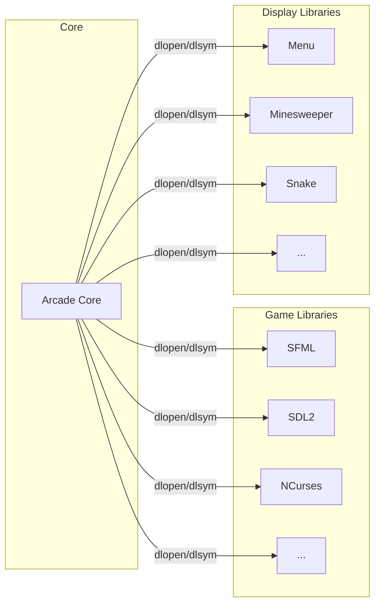
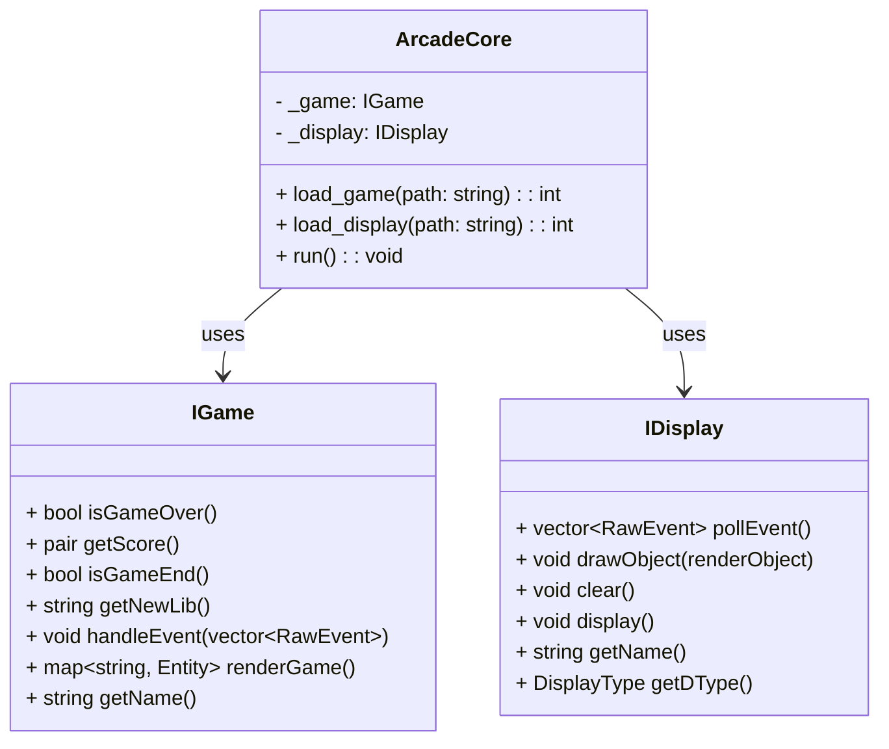
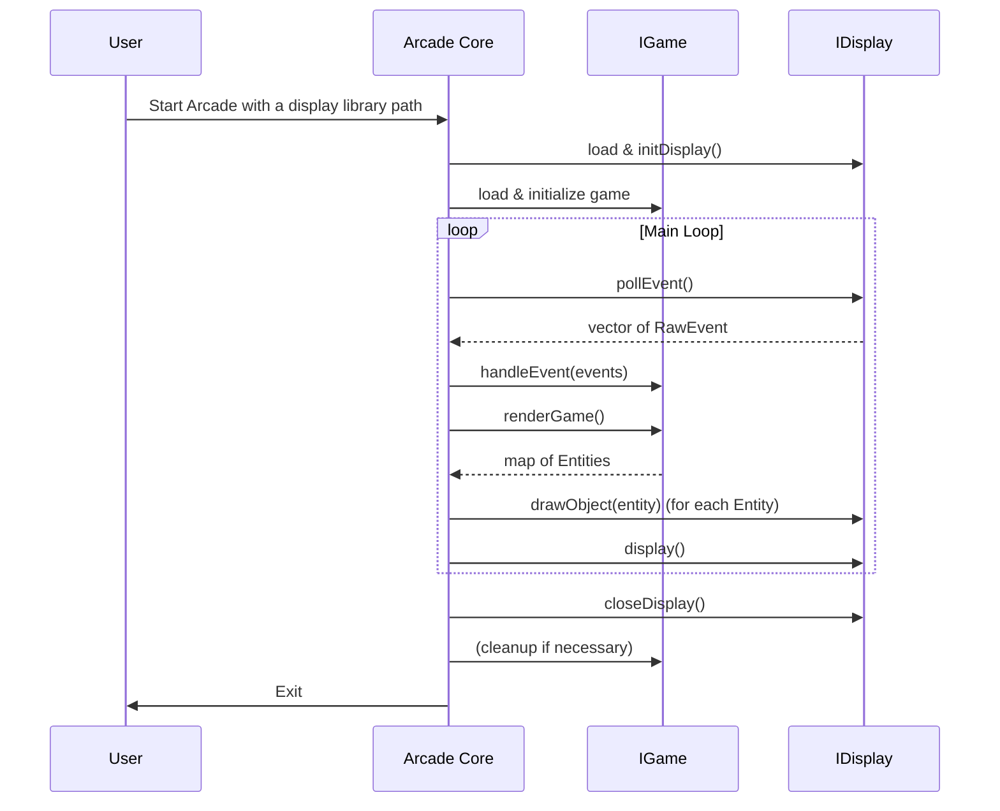

# Core Architecture

The core of the Arcade platform is designed to be modular and extensible. The architecture consists of two main components:

1. **Game Libraries**: Each game is implemented as a dynamic library that adheres to the `IGame` interface. This allows for easy integration and switching between different games.
2. **Display Libraries**: Each display library is also implemented as a dynamic library that adheres to the `IDisplay` interface. This allows for different rendering methods (e.g., graphical, terminal) to be used interchangeably.
3. **Core Application**: The main application (`arcade`) manages the loading and unloading of game and display libraries, handles user input, and coordinates the rendering of game objects.
4. **Event Handling**: The core application handles user input events and passes them to the appropriate game library for processing.
5. **Rendering**: The core application retrieves the game state from the game library and uses the display library to render the game objects on the screen.
- **Game Logic**: Each game library is responsible for its own game logic, including handling events, updating the game state, and rendering the game objects.
- **Display Logic**: Each display library is responsible for rendering the game objects on the screen and handling user input events.
- **Dynamic Loading**: The core application uses `dlopen`, `dlsym`, and `dlclose` to dynamically load and unload game and display libraries at runtime.
- **Error Handling**: The core application handles errors gracefully, providing informative messages to the user when issues arise.

# Core Architecture

This document explains how the **Arcade Core** manages interactions between **Game Libraries** (IGame implementations) and **Display Libraries** (IDisplay implementations). The core is responsible for dynamically loading libraries, coordinating the game loop, and routing events between game logic and rendering.

## High-Level Overview

1. **Arcade Core** uses dynamic loading (dlopen, dlsym) to load:
   - One **Game Library** (IGame) at a time.
   - One **Display Library** (IDisplay) at a time.
2. The chosen **Game Library** handles logic, while the chosen **Display Library** handles rendering and event polling.
3. Switching libraries at runtime involves unloading the current library and loading the new one, following the same interface contracts.

---

## Core Class Relationships

1. **ArcadeCore** loads and holds references to one **IGame** and one **IDisplay** implementation.
2. **IGame** and **IDisplay** are interfaces, so multiple implementations can be substituted without changing the core.

---

## Sequence of Operations

Below is a simplified sequence diagram of a typical main loop.

1. **Initialization**: The core loads the chosen display library, initializes it, then loads the chosen game library.
2. **Event Handling**: The core polls events from the display library, then forwards them to the game library's `handleEvent`.
3. **Rendering**: The core requests entities to render from the game (`renderGame`), then instructs the display library to draw them (`drawObject`).
4. **Loop Exit**: When the user quits or the game ends, the core closes the display and cleans up game resources.

---

## Key Responsibilities

### Arcade Core
- **Dynamic Library Loading**: Uses `dlopen`/`dlsym` to load `IGame` and `IDisplay` implementations at runtime.
- **Event Routing**: Polls events from the display library and sends them to the game library.
- **Rendering Coordination**: Retrieves game entities and instructs the display library to render them.
- **Library Switching**: Can unload the current game or display library and load a new one without restarting the entire application.

### IGame Implementations
- **Game Logic**: Implement logic, scoring, and progression within the `IGame` interface.
- **Entity Representation**: Return a collection of `Entity` objects for the core to display.
- **Event Processing**: React to user inputs (via `RawEvent`).

### IDisplay Implementations
- **Rendering**: Implement the `drawObject` method to render `renderObject` structures.
- **Event Polling**: Capture user input and system events, returning them to the core.
- **Display Lifecycle**: Handle initialization, clearing, and updating the screen.

---

## Additional Notes

- **Error Handling**: The core should detect library loading failures or interface mismatches and exit gracefully (return code `84`).
- **Performance**: Both the game logic and rendering should be optimized for minimal latency. The main loop typically runs at a fixed or dynamic frame rate.
- **Extensibility**: By adhering to `IGame` and `IDisplay` interfaces, new modules can be added without modifying the core logic.

